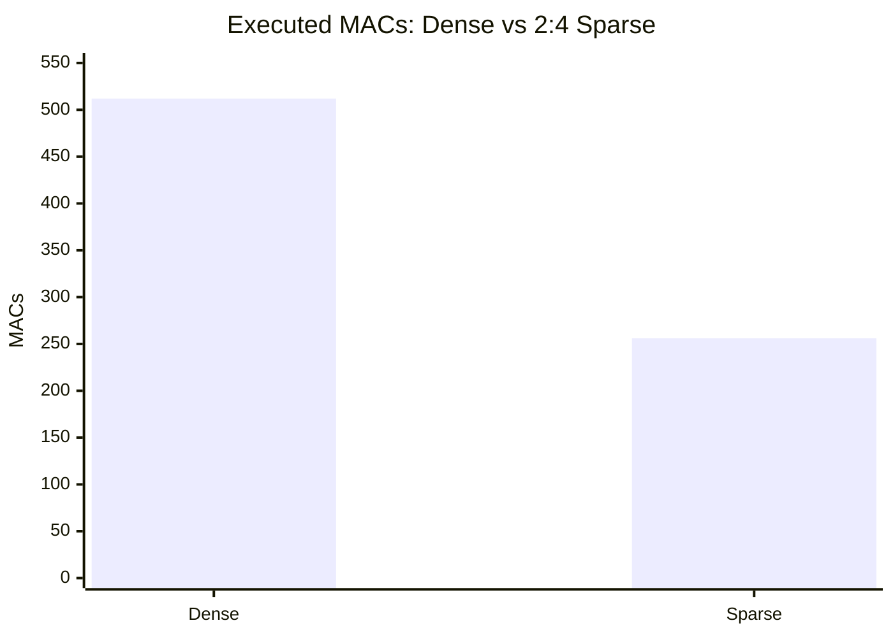
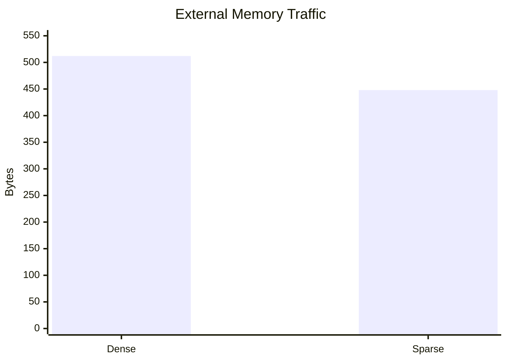
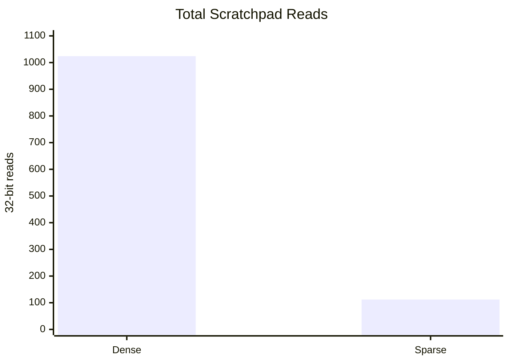
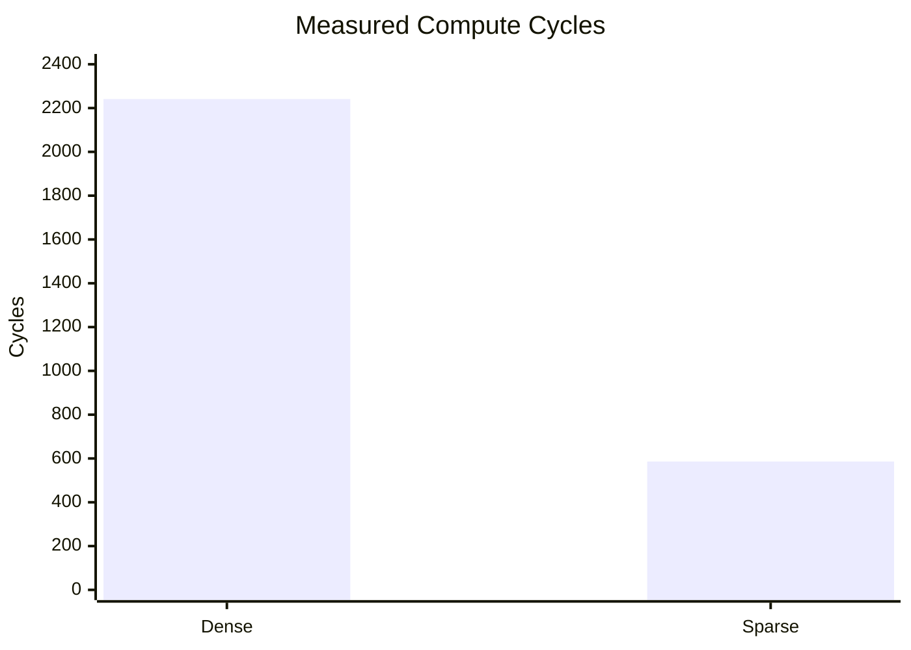
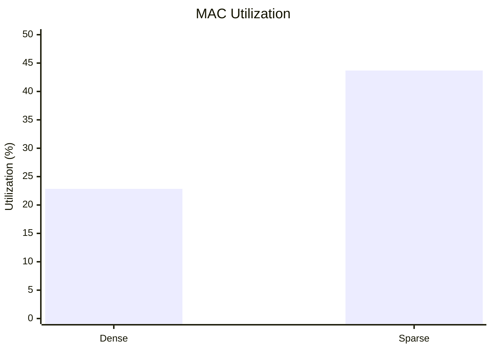
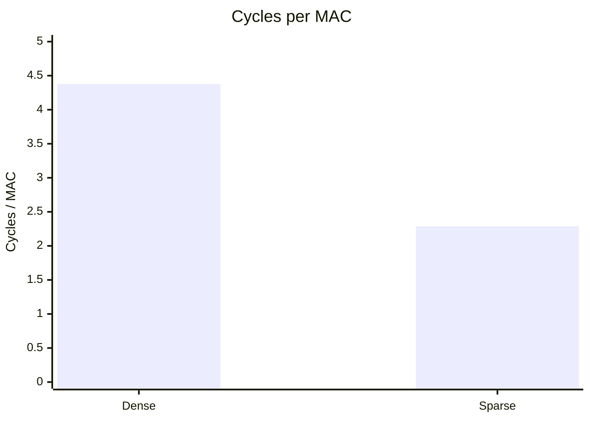

# RISC-V Integrated Dense vs. Hardware-Enforced 2:4 Sparse Accelerator
## Quantitative Results and Research Question

> **Status:** Results accumulated from the verified 8×8 dense baseline and verified memory-integrated 8×8 sparse datapath.  
> **Important:** Only measurements that were actually established in the project are reported. Values not yet measured are marked **NR (Not Reported / Not Yet Measured)** rather than estimated.

---

## 1. Research Question

> **How does hardware-enforced 2:4 structured sparsity affect computation, memory traffic, scratchpad utilization, and end-to-end execution efficiency in a RISC-V-integrated accelerator compared with an equivalent dense architecture?**

### Why this is the right research question

The project is not only asking whether 2:4 sparsity reduces the number of mathematical operations. It evaluates whether the reduction in computation translates into a useful **system-level benefit** after accounting for:

- compressed weight/value storage,
- sparsity metadata,
- external memory transfers,
- scratchpad accesses,
- sparse control/decode overhead,
- compute cycles,
- MAC utilization,
- and, ultimately, end-to-end execution time.

The dense and sparse datapaths use the same 8×8 problem size, allowing the sparse implementation to be compared against an established dense baseline.

---

# 2. Experimental Scope

### Common workload

- Matrix size: **8×8**
- Datapath type: matrix-multiply / GEMM-style computation
- Sparse format: **exact 2:4 structured sparsity**
- Sparse computation: two non-zero values retained from every group of four
- Dense MAC opportunities: **8 × 8 × 8 = 512**
- Sparse MACs: **256**
- Sparse MAC reduction: **50%**

### Sparse data representation

For the verified 8×8 sparse memory-integrated test:

| Component | Dense | Sparse |
|---|---:|---:|
| A values transferred | 256 B | 128 B |
| B values transferred | 256 B | 256 B |
| Metadata | 0 B | 64 B physical storage |
| Total external traffic | **512 B** | **448 B** |

The sparse design therefore does **not** halve external traffic, because matrix B remains dense and sparsity metadata must also be transferred.

---

# 3. Main Quantitative Comparison

| Metric | Dense | Sparse (2:4) | Change / Observation |
|---|---:|---:|---|
| **MACs** | 512 | **256** | **50% fewer MACs** |
| **External memory bytes** | 512 B | **448 B** | **12.5% reduction** |
| **Memory requests** | 4 | **4** | Same request count for this burst configuration |
| **Scratchpad A reads** | 512 | **32** | **93.75% reduction** |
| **Scratchpad B reads** | 512 | **64** | **87.5% reduction** |
| **Metadata reads** | 0 | **16** | Required by sparse representation |
| **Total scratchpad reads** | 1024 | **112** | **89.06% reduction** |
| **Physical metadata overhead** | 0 B | **64 B** | 16 metadata entries × 4 B |
| **Compute cycles** | 2241 | **586** | **73.85% reduction** |
| **End-to-end cycles** | 2460 | **NR** | Sparse E2E measurement still required |
| **MAC utilization** | 22.8469% | **43.686%** | ~**91.21% relative increase** |
| **Cycles / MAC** | 4.376953 | **2.28906** | **47.70% fewer cycles/MAC** |
| **Area** | NR | **NR** | Requires matched synthesis/implementation run |
| **Power** | NR | **NR** | Requires matched power analysis |
| **Fmax** | NR | **NR** | Requires matched timing analysis |

**NR = Not yet measured / not established in the current experimental dataset.**

---

# 4. Derived Quantitative Findings

## 4.1 Computation reduction

Dense:

**8 × 8 × 8 = 512 MACs**

For exact 2:4 sparsity, half of the values are retained:

**512 × (2 / 4) = 256 MACs**

Therefore:

**50% MAC reduction**

---

## 4.2 External memory traffic

Dense traffic:

**256 B (A) + 256 B (B) = 512 B**

Sparse traffic:

**128 B (A) + 256 B (B) + 64 B (metadata) = 448 B**

Reduction:

**(512 − 448) / 512 × 100 = 12.5%**

This is an important result because it shows that **50% computation reduction does not automatically produce 50% external memory-traffic reduction**.

The sparse architecture removes half of A's stored values, but B remains dense and metadata introduces additional traffic.

---

## 4.3 Scratchpad utilization / access reduction

Dense scratchpad reads:

**512 A reads + 512 B reads = 1024 reads**

Sparse scratchpad reads:

**32 A reads + 64 B reads + 16 metadata reads = 112 reads**

Reduction:

**(1024 − 112) / 1024 × 100 = 89.06%**

Breakdown:

- A reads: **512 → 32 = 93.75% reduction**
- B reads: **512 → 64 = 87.5% reduction**
- Metadata reads: **0 → 16**
- Total: **1024 → 112 = 89.06% reduction**

This demonstrates that the sparse datapath changes not only arithmetic work but also the amount of data consumed from the scratchpad.

---

## 4.4 Compute-cycle reduction

Measured compute cycles:

- Dense: **2241 cycles**
- Sparse: **586 cycles**

Reduction:

**(2241 − 586) / 2241 × 100 = 73.85%**

Compute-cycle speedup:

**2241 / 586 = 3.82×**

Thus, for the measured 8×8 compute phase, the reduction in MAC work produces a much larger improvement than the 12.5% reduction in external memory traffic.

---

## 4.5 MAC utilization

Dense MAC utilization:

**22.8469%**

Sparse MAC utilization:

**43.686%**

Relative increase:

**(43.686 − 22.8469) / 22.8469 × 100 ≈ 91.21%**

The sparse datapath therefore achieves approximately **1.91× the dense MAC utilization** under the measured workload.

This should be interpreted as a measured datapath-efficiency result, not as a universal claim for all workloads.

---

## 4.6 Cycles per MAC

Dense:

**4.376953 cycles/MAC**

Sparse:

**2.28906 cycles/MAC**

Reduction:

**(4.376953 − 2.28906) / 4.376953 × 100 ≈ 47.70%**

The sparse implementation therefore requires substantially fewer cycles for each executed MAC under this benchmark.

---

# 5. Comparison Graphs

These charts are written in GitHub-compatible Mermaid format.

## 5.1 MAC Work

**Interpretation:** Hardware-enforced 2:4 sparsity cuts the executed MAC count by exactly 50% for the 8×8 workload.

---

## 5.2 External Memory Traffic

**Interpretation:** External traffic falls by only 12.5%, demonstrating the cost of retaining dense B and transferring sparse metadata.

---

## 5.3 Scratchpad Reads

**Interpretation:** Scratchpad read activity falls by approximately 89.06%.

---

## 5.4 Compute Cycles

**Interpretation:** The measured sparse compute phase is approximately 3.82× faster than the dense compute phase.

---

## 5.5 MAC Utilization

**Interpretation:** Sparse execution reaches approximately 43.69% MAC utilization versus 22.85% for dense execution.

---

## 5.6 Cycles per MAC

**Interpretation:** Lower is better. Sparse execution requires approximately 47.70% fewer cycles per executed MAC.

---

# 6. Memory-Request Observation

Both implementations currently show:

\boxed{4 external memory requests

for the measured 8×8 burst configuration.

The sparse test generated the following verified requests:

| Request | Start address | Transfer size | Beats |
|---|---:|---:|---:|
| A | `0x10000000` | 128 B | 16 |
| B | `0x10000100` | 128 B | 16 |
| B continuation | `0x10000180` | 128 B | 16 |
| Metadata | `0x10000200` | 64 B | 8 |
| **Total** | — | **448 B** | **56 beats** |

The request count staying at four while the transferred data decreases is an important architectural observation: **request count and byte traffic are different metrics**.

---

# 7. Functional Verification Evidence

The sparse memory-integrated 8×8 datapath produced the expected complete 8×8 result matrix with:

**64/64\ results\ correct**

and:

**0\ mismatches**

The measured sparse compute count was:

**256\ MACs**

which matches the expected 50% reduction from the dense 512-MAC workload.

### Verified sparse result matrix

| Row | C[0] | C[1] | C[2] | C[3] | C[4] | C[5] | C[6] | C[7] |
|---|---:|---:|---:|---:|---:|---:|---:|---:|
| 0 | 3460 | 3560 | 3660 | 3760 | 3860 | 3960 | 4060 | 4160 |
| 1 | 8900 | 9160 | 9420 | 9680 | 9940 | 10200 | 10460 | 10720 |
| 2 | 1294 | 1420 | 1546 | 1672 | 1798 | 1924 | 2050 | 2176 |
| 3 | 1742 | 1804 | 1866 | 1928 | 1990 | 2052 | 2114 | 2176 |
| 4 | 2358 | 2436 | 2514 | 2592 | 2670 | 2748 | 2826 | 2904 |
| 5 | 2406 | 2500 | 2594 | 2688 | 2782 | 2876 | 2970 | 3064 |
| 6 | 2838 | 2948 | 3058 | 3168 | 3278 | 3388 | 3498 | 3608 |
| 7 | 3850 | 3980 | 4110 | 4240 | 4370 | 4500 | 4630 | 4760 |

---

# 8. What These Results Say About the Research Question

The measurements provide evidence for four distinct effects of hardware-enforced 2:4 sparsity.

### 1. Computation

2:4 sparsity reduces the required MAC operations from:

512 → 256

giving a:

**50%\ reduction\ in\ MAC\ work**

### 2. External memory traffic

Traffic decreases from:

512B → 448B

giving:

**12.5%\ reduction**

The reduction is smaller than the MAC reduction because B remains dense and metadata must be transferred.

### 3. Scratchpad activity

Total scratchpad reads decrease from:

1024 → 112

giving:

**89.06%\ reduction**

This is one of the strongest measured architectural differences between the two datapaths.

### 4. Compute efficiency

Compute cycles decrease from:

2241 → 586

giving:

**73.85%\ reduction**

or approximately:

\boxed{3.82×\ compute-phase\ speedup

At the same time, measured MAC utilization increases from:

22.8469% → 43.686%

and cycles/MAC decrease from:

4.376953 → 2.28906

---

# 9. What This Can Support as a Research Contribution

The strongest defensible claim is **not** that individual components such as RISC-V integration, 2:4 sparsity, DMA, scratchpads, or systolic-style computation are individually novel.

Instead, the useful research contribution is the **system-level evaluation of hardware-enforced exact 2:4 sparsity inside a RISC-V-integrated accelerator**, with the dense implementation serving as a controlled baseline.

The current measurements allow the project to investigate the trade-off:

\boxed{
50% fewer MACs
 ≠ 
50% less memory traffic

while simultaneously showing:

**
89.06%\ less\ scratchpad\ read\ activity
**

and:

**
73.85%\ fewer\ measured\ compute\ cycles
**

This makes the project more interesting than a simple demonstration that sparse arithmetic performs fewer multiplications.

The key research question becomes:

> **When the cost of sparsity metadata, memory movement, scratchpad accesses, and control overhead is included, how much of the theoretical 2:4 computation reduction becomes a real system-level performance benefit?**

---

# 10. Results That Still Need to Be Measured

The following values should **not** be invented or inferred before the next measurement phase:

| Metric | Dense | Sparse | Required experiment |
|---|---:|---:|---|
| End-to-end cycles | **2460** | **NR** | Same start/end definition for both designs |
| Area | NR | NR | Matched synthesis/implementation |
| Power | NR | NR | Matched workload + power analysis |
| Fmax | NR | NR | Matched timing constraints |
| LUTs | NR | NR | Synthesis |
| Flip-flops | NR | NR | Synthesis |
| DSPs | NR | NR | Synthesis |
| BRAM | NR | NR | Synthesis |
| WNS/TNS | NR | NR | Static timing analysis |

### Important experimental rule

Before claiming an end-to-end speedup, the sparse design needs a measured end-to-end cycle count using the **same definition and measurement boundary** as the dense baseline.

Likewise, area, power, and Fmax must be measured under matched synthesis/implementation conditions.

---

# 11. Recommended Final Comparison for the Research Paper

Once the remaining measurements are available, the final table should follow this structure:

| Metric | Dense | 2:4 Sparse | Improvement |
|---|---:|---:|---:|
| MACs | 512 | 256 | 50% fewer |
| External memory bytes | 512 B | 448 B | 12.5% lower |
| Memory requests | 4 | 4 | Same |
| Scratchpad reads | 1024 | 112 | 89.06% lower |
| Metadata overhead | 0 B | 64 B | Sparse-only overhead |
| Compute cycles | 2241 | 586 | 73.85% lower |
| End-to-end cycles | 2460 | **TBD** | **TBD** |
| MAC utilization | 22.85% | 43.69% | ~91.21% relative increase |
| Cycles/MAC | 4.377 | 2.289 | 47.70% lower |
| Area | TBD | TBD | TBD |
| Power | TBD | TBD | TBD |
| Fmax | TBD | TBD | TBD |

---

# 12. Current Conclusion

For the verified 8×8 workload, hardware-enforced exact 2:4 sparsity produces:

- **50% fewer MACs**
- **12.5% lower external memory traffic**
- **89.06% fewer total scratchpad reads**
- **73.85% fewer compute cycles**
- **3.82× compute-phase speedup**
- **~91.21% relative increase in measured MAC utilization**
- **47.70% fewer cycles per MAC**
- **64 correct output values with zero mismatches**
- **256 measured sparse MACs, matching the expected 2:4 computation count**

The results therefore demonstrate a measurable architectural effect across **computation, memory traffic, scratchpad activity, and compute efficiency**.

However, the current dataset does **not yet justify a claim about sparse end-to-end speedup, area efficiency, power efficiency, or Fmax improvement**. Those require controlled measurements before they are included in the final research claim.

---

## One-line research takeaway

> **Hardware-enforced 2:4 sparsity halved the executed MAC work and reduced measured compute cycles by 73.85%, while external memory traffic fell by only 12.5% because dense operands and sparsity metadata remain part of the system-level data movement—demonstrating why sparsity must be evaluated at the architecture and memory-system level rather than by MAC count alone.**
